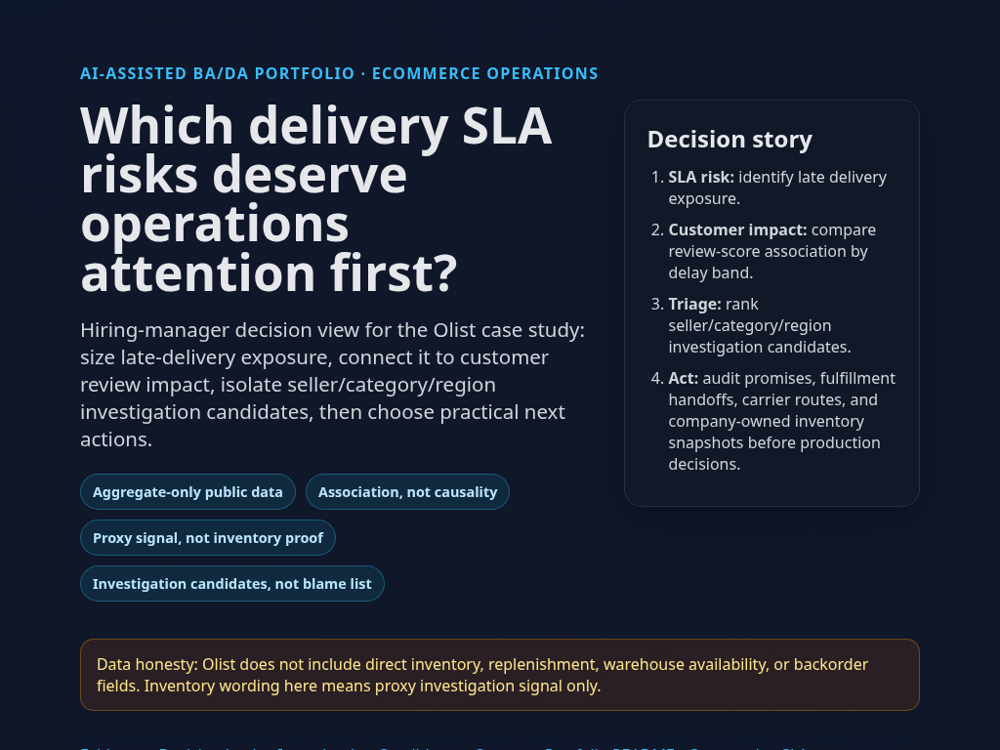

# 🤖 AI-Assisted BA/DA Portfolio

Recruiter-first proof: AI-assisted Business Analysis + Data Analysis applied to real ecommerce fulfillment risk.

## 🚚 Main Case Study: Olist Delivery SLA Risk

**Business problem:** ecommerce marketplaces lose trust when seller, category, and region lanes miss delivery promises. This project uses real Olist order data to identify delivery SLA risk, prioritize investigation candidates, and connect delay severity to customer review outcomes.

**Positioning:** fulfillment and delivery SLA risk analysis with fulfillment-planning proxy signals. Olist does **not** include direct inventory, replenishment, backorder, or inventory-balance fields, so inventory language here means proxy/investigation signal only — not direct stockout or overstock measurement.

## 📌 Verified Real-Data Findings

From delivered Olist orders:

| Metric | Result |
|---|---:|
| Delivered orders analyzed | 96,470 |
| Late delivered orders | 6,534 |
| Late delivery rate | 6.77% |
| Average delivery days | 12.09 |
| Average days late among late orders | 10.62 |

What matters:

- **Delivery risk exists but is concentrated.** Most orders meet promise, but specific seller/category/region lanes create investigation targets.
- **Late orders are materially late.** Average lateness among late orders is 10.62 days, enough to affect customer experience and operational workload.
- **Review scores are associated with delay bands.** On-time/early orders average 4.29 review score; 4-7 day late orders average 2.11; 8-14 day late orders average 1.67. This shows association, not single-cause proof.
- **Inventory framing stays honest.** Delivery delay, demand velocity, category, seller, and region patterns are triage signals for fulfillment-planning investigation, not proof of stockouts or overstock without inventory snapshots.

## 🔗 Findings Artifacts

- [Live Static Dashboard](https://im-khang.github.io/ai-business-data-analysis-portfolio/inventory-stockout-overstock-analysis/)

[](https://im-khang.github.io/ai-business-data-analysis-portfolio/inventory-stockout-overstock-analysis/)
- [Delivery SLA Summary](case-studies/inventory-stockout-overstock-analysis/artifacts/delivery-sla-summary.md)
- [Seller / Category / Region Risk Prioritization](case-studies/inventory-stockout-overstock-analysis/artifacts/seller-category-region-risk.md)
- [Review Impact Summary](case-studies/inventory-stockout-overstock-analysis/artifacts/review-impact-summary.md)
- [Full Case Study Folder](case-studies/inventory-stockout-overstock-analysis/README.md)

## ✅ What This Portfolio Proves

- BA problem framing for ecommerce operations and logistics stakeholders
- KPI logic from 96,470 delivered orders, 6.77% late rate, and 10.62 average days late
- SQL/Python analysis across multi-table public marketplace data
- Seller/category/region risk queue for operational investigation candidates
- Review-score delay-band analysis with causality caveats
- AI-assisted workflow discipline without replacing analytical judgment

## 🗂️ Repository Structure

```text
case-studies/
  inventory-stockout-overstock-analysis/
    README.md
    artifacts/
      delivery-sla-summary.md
      seller-category-region-risk.md
      review-impact-summary.md
      stakeholder-map.md
      requirements.md
      kpi-tree.md
      process-flow.md
      assumptions.md
    sql/
    notebooks/
    data/
    dashboard/
ai-workflow-log/
docs/
```

## 🧭 Data Honesty

Raw Olist CSVs are local-only and ignored by git. Public repo contains analysis code, SQL, BA artifacts, and findings summaries. See [data setup notes](case-studies/inventory-stockout-overstock-analysis/data/README.md) for source and local placement. Inventory, stockout, and overstock wording is proxy-only because Olist lacks direct inventory fields.
