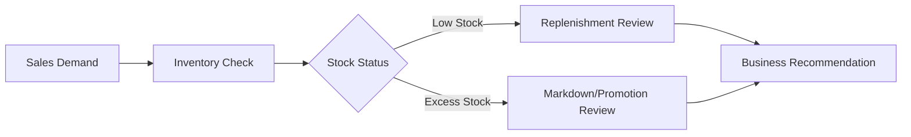

# 🔄 Process Flow

Draft placeholder. Will be refined during BA workflow.

```mermaid
flowchart LR
    A[Sales Demand] --> B[Inventory Check]
    B --> C{Stock Status}
    C -->|Low Stock| D[Replenishment Review]
    C -->|Excess Stock| E[Markdown/Promotion Review]
    D --> F[Business Recommendation]
    E --> F
```
